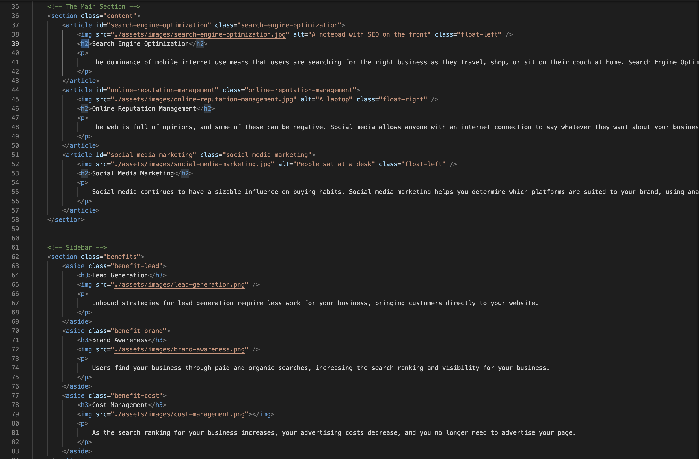

# Semantic HTML

Our task was to edit existing code in order to improve a websites accessibility.


## Challenges 

I had a hard time reading and working out the CSS code. I’m going to improve it by working on the ZenGarden site, and doing something on my own. 

I also have a tendency to overcomplicate things, especially when it comes to HTML and code in general.  

## Things I Learned

!
[Screenshot](./assets/images/Screenshot1.png)

Basic semantics such as 

```
<nav>
<article>
<aside>
```

How to hide a footer.

Adapting the CSS code so it doesn’t repeat itself. 

## Contact

[Github Profile](https://github.com/LiamLJhoward/) // [Email](mailto:liamljhoward@gmail.com)

